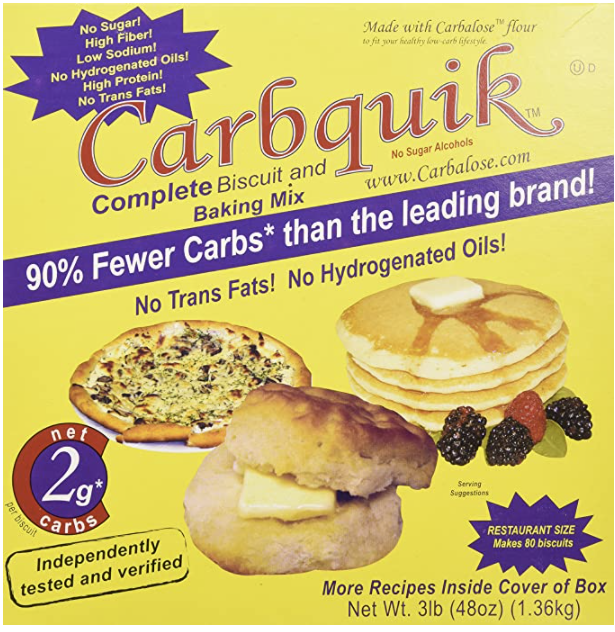
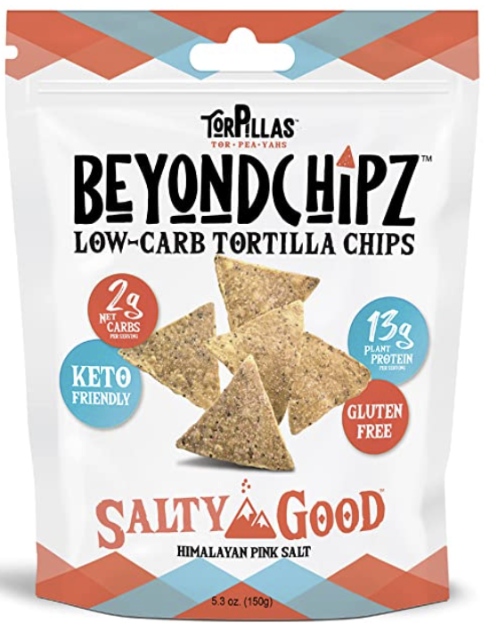

# Main Meal Items
|Item|Quantity|Calories|Total Carbs (g)|Net Carbs (g)|Protein (g)|Fat (g)|
|-|-|-|-|-|-|-|
|A.1. Sauce, Original|1 Tablespoon|15|3|3|0|0|
|Almond bomb|2 Serving|389.2|13.09|7.21|11.15|35.09|
|Almonds|6 Cups, Ground|3408.6|119.75|55.99|119.47|299.47|
|Bacon|2 Ounces|265.4|0.96|0.95|19.23|19.9|
|BallPark Beef Franks|2 Frank|360|8|8|12|30|
|Banquet Sausage Links, Fully Cooked|1 Links|60|0.67|0.67|2.33|5.33|
|Beef steak, sirloin, no visible fat eaten|2 Ounces|90.7|0|0|16.95|2.55|
|Beef top sirloin steak|2 Ounces|115.7|0|0|17.39|5.1|
|Bfast hash|1 Serving|594.2|4.71|4.7|30.56|48.08|
|Bolthouse Farms Classic Ranch Yogurt Dressing|2 Tablespoons|45|3|3|1|3|
|Bubly Sparkling Water, Blackberry|1 Can|0|0|0|0|0|
|Buffalo Wild Wings 3 Count Naked Chicken Tenders|1-½ Serving|240|0|0|55.5|1.5|
|Buffalo Wild Wings 5 Count Naked Chicken Tenders|1 Serving|260|0|0|61|2|
|Buffalo Wild Wings 6 Count Boneless Wings, Add Original Buffalo Sauce|1 Serving|170|2|2|0|18|
|Buffalo Wild Wings Boneless and Traditional Wings Combo (see 6 count wings for sauce and seasoning nutrition)|1 Serving|1280|101|94|86|59|
|Buffalo Wild Wings Chicken Wings - mild sauce|10 Piece|800|1.67|1.67|88.33|47.5|
|Buffalo Wild Wings Grocery Wing Sauce, Mild|4 Tablespoons|100|4|4|0|10|
|Buffalo Wild Wings Original Buffalo Sauce|1 Fluid Ounce|110|1|1|0|12|
|Buffalo Wild Wings Ranch Dressing|2 Fluid Ounces|320|2|2|1|34|
|Carb0licious Low carb Melba toast|8 Sliced|120|6|2|14|7|
|Carb0licious Melba Toast, Plain|16 Slices|280|12|4|28|14|
|Carbonaut White Bread|2 Slice|160|18|4|14|7|
|Catalina Crunch Peanut Butter Cookie|2 Piece|90|11|5|4|6|
|Catalina Crunch Peanut Butter Cookies|½ x 2 cookies|45|5.5|2.5|2|3|
|Cheddar cheese|3 Ounces|342.7|2.87|2.86|19.45|28.33|
|Chef's Cut Real Jerky Co. Zero Sugar Original Beef & Pork Stick|1 Stick|100|0|0|8|7|
|Chicken|3 Ounces|161.6|0|0|24.6|6.3|
|Chicken breast|1 Ounce|49|0|0|8.76|1.28|
|Chicken breast, skin removed before cooking|3 Ounces|147.1|0|0|26.29|3.84|
|Chicken breast, skin removed before eating|4 Ounces|196.2|0|0|35.05|5.11|
|Claussen Deli-Style Kosher Dill, Spears|2 Spear|20|2|2|0|0|
|Country Crock Vegetable Oil Spread, Original|2 Tablespoons|100|0|0|0|12|
|Cut swerve fat bomb|3 Piece|568.5|16.31|10.38|9.82|53.18|
|Egg|1 Large|77.5|0.56|0.56|6.29|5.31|
|First queso|1 Serving|390.5|1.14|1.14|35.47|26.31|
|Frigo Cheesehead, Original String|6 Piece|480|6|6|36|36|
|Fucked swerve pnut fatbomb|2 Serving|746|37.4|10.52|18.75|64.25|
|Funyuns Onion Flavored Rings|1 Package|110|14|13|2|5|
|Genius Gourmet Chocolate Keto Shake|½ Drink|85|2.5|2|3|7.5|
|Great Value Carne Asada Steak|⅓ Cup|99.9|2.66|2|13.32|4|
|Great Value Colby & Monterey Jack Cheese|2 Slice|140|0|0|8|12|
|Great Value Colby & Monterey Jack Cheese Sticks|2 Stick|160|0|0|10|14|
|Great Value Fiesta Blend Cheese|⅓ Cup|146.5|1.33|1.33|7.99|10.66|
|Great Value Mini Cookies, Iced Oatmeal|1 Pack|120|18|18|1|5|
|Great Value Monteray Jack Cheese|1 Serving|100||0|7|8|
|Great Value Organic Medium Garden Pepper Salsa|2 Tablespoons|10|2|1.5|0|0|
|Great Value Pizza Sauce|⅛ Cup|12.5|2|1.5|0.5|0.5|
|Great Value Provolone Cheese|1 Slice|70|0|0|5|5|
|Great Value Shredded Mozzarella Cheese|½ Cup|160|4|4|12|10|
|Great Value Sliced Munster Cheese|1 x 1 slice|70|0|0|4|6|
|Great Value String Cheese, Mozzarella|2 Stick|160|1|1|14|12|
|Ground beef|6 Ounces|364|0|0|45.28|18.88|
|Ground turkey|3 Ounces|219.4|0|0|21.36|14.84|
|Ham|10 Ounces|316.3|3.19|3.16|47.77|11.46|
|Hamburger meat|3 Ounces|182|0|0|22.64|9.44|
|Hamburger or ground beef, 80% lean|3 Ounces|216|0|0|21.48|13.75|
|Hamburger or ground beef, 90% lean|4 Ounces|242.7|0|0|30.19|12.59|
|Havarti cheese|2 Slice (from pre-sliced package) - each 3/4 ounce|176.3|0.5|0.45|8.83|15.44|
|Head Country Bar-B-Q Sauce, Sugar Free|2 Tablespoons|10|2|2|0|0|
|Hidden Valley Ranch Dressing|2 Tablespoons|120|2|2|0|13|
|HighKey Honey Nut Cereal|2 Servings|160|2|2|||
|Highkey Protein Cereal, Cocoa|2 Cups|360|44|0|40|20|
|Hilo Oh so Jalapeño Crispy Pepper Jack Cheese & Almonds|1 Package|250|5|3|12|19|
|Hormel Uncured Hard Salami|4 Slices|110|0|0|6|10|
|Jack Link's Meat Snacks Zero Sugar Beef Jerky|1 Ounce|80|1|1|15|1.5|
|Jack Link's Meat Snacks Zero Sugar Original Beef Jerky|3 Ounces|210|0|0|39|6|
|Jimmy Dean Breakfast Bowl, Meat Lovers|1 Bowl|480|16|14|23|37|
|Jimmy Dean Original Pork Sausage Links, Fully Cooked|1 Links|90|0.33|0.33|2.67|8.67|
|Jimmy Dean Pork Sausage Patties, Fully Cooked|4 Patties|560|1|1|16|54|
|Jimmy Dean Simple Scrambles, Meat Lovers|1 Package|290|2|2|22|22|
|John Soules Foods Chicen Fajitas|¼ Pound|148.5|4.05|4.05|25.65|2.7|
|Kellogg's Pop-tart Frosted Strawberry Toaster Pastry|2 Pastry|360|76|70|4|5|
|Keto Bars Cocoa Dusted Almonds Real Food Snacks|¼ Package|35|2.5|1.75|1|3|
|Keto Culture Baking White Bread|2 Slice|80|24|0|8|3|
|Keto Naturals Cracker Thins Sour cream and spring onion|1 Serving|82|2.1|2.1|5.7|4.3|
|KetoScience Keto Mealshake, Chocolate Cream|2 Scoop|224|3|2|8|20|
|King Size KitKat|⅓ x 3 fingers|53.3|6.99|6.99|0.67|2.66|
|Kingsford's Seasoned Pork Carnitas|¼ Ounce|10.8|0.08|0.08|1.25|0.58|
|Kroger Sharp Cheddar Cheese|1 Ounce|111.4|0|0|7.09|9.11|
|Love Good Fats Chocolatey Almond Chewy Nutty|1 Bar|190|14|4|6|15|
|Magic Spoon (Canada) Grain-Free Cereal - Fruit|2 Cups|300|30|8|26|16|
|Magic Spoon Fruity Cereal|2 Cups|300|30|8|26|16|
|Magic Spoon Peanut Butter Grain-Free Cereal|2 Cups|346.7|21.33|8|29.33|21.33|
|Mama Lupe's Fresh Tortillas, Three Net-Impact Carbs|2 Tortilla|140|20|6|10|4|
|Mama Mary's Pepperoni, Gourmet|15 Slices|140|0|0|7|13|
|Member's Mark Bacon Wrapped Beef Tenderloin|8 Pieces|240|1.6|1.6|25.6|12.8|
|Member's Mark Colby Jack cheese sticks|2 Piece|160|0|0|10|14|
|Member's Mark Colby Jack Natural Cheese|4 Stick|320|2|2|20|28|
|Member's Mark Mexican Style Cheese|0.33 Cup|110|1|1|7|9|
|Member's Mark Smooth & Creamy Almond Unsweetened Vanilla|1 Cup|30|1|0.5|1|2.5|
|Mexican blend cheese|½ Ounce|57.1|0.48|0.48|3.24|4.72|
|Mission Low Carb Tortilla|3 x 1|210|57|12||9|
|Mission Meats Beef Sticks, Original|½ Ounce|40|0.5|0.5|3.5|3|
|Mr. Tortilla Multigrain 1 Net Carb Tortillas|3 Tortilla|45|9|3|3|1.5|
|Munster|1 x 1 slice|80|0|0|5|7|
|Mustard|1 Teaspoon|3.1|0.3|0.09|0.19|0.17|
|NuTrail Keto Nut Granola, Blueberry Cinnamon|½ Cup|240.2|13.51|3|6.01|22.52|
|Ole Mexican Foods Xtreme Wellness, Tomato Basil|1 Tortilla|50|15|4|5|1.5|
|On The Border Mexican Grill & Cantina Salsa, Mild|¾ Cup|60|12|12|0|0|
|Optimum Nutrition Gold Standard Whey, Rich Chocolate|3 Scoop|360|9|9|72|3|
|Peanuts|1-¼ Cup|1071.3|38.8|23.22|44.44|90.63|
|Pep pizza|2 Slice|182|10.08|2.83|10.36|14.03|
|Pepper Jack cheese|1 Ounce|107.2|0.5|0.5|6.11|9.01|
|Perfect Keto Keto Cookies, Chocolate Chips|3 Cookies|315|27|6|9|28.5|
|Pico de gallo|2 Tablespoons|4.2|0.94|0.7|0.18|0.04|
|Pork King Good Ranch Seasoned Pork Rind Crumbs|14 Grams|85|0|0|8|5|
|Provolone cheese, natural|1 Ounce|99.5|0.61|0.61|7.25|7.55|
|Queso fresco (Mexican white cheese)|1 Ounce|84.8|0.85|0.85|5.13|6.75|
|Quest Protein Cookie, Double Chocolate Chip Flavor|1 Cookie|240|21|5|15|15|
|Red Bull Sugar Free Energy Drink|2 Can - each 8.4 fo|25.3|3.54|3.54|1.27|0.4|
|Right swerve fat bomb|1 Piece|226.2|7.63|6.21|4|21.66|
|Roast beef, shoulder, visible fat eaten|8 Ounces|748.4|0|0|52.39|58.13|
|Salad|1 Cup|40.8|4.31|2.13|0.93|2.68|
|Sam's Choice Boneless Ham Steak|3 Ounces|90|3|3|14|1.5|
|Saputo Havarti|2 Slice|260|0|0|12|24|
|Sargento Colby-Jack Cheese Sticks|3 Piece|240|0|0|15|21|
|Sargento Sharp Cheddar Cheese|2 Ounces|216|0|0|13.5|18.9|
|Sausage patty|1 Ounce|124.2|0.18|0.17|4.29|11.81|
|Scotty's Everyday Keto pizza crust mix|4 Serving|23.3|4.67|0.33|0.83|1.67|
|Scrambled egg, plain|2 Extra large egg used - 1 whole egg or 2 egg whites|238.8|2.96|2.95|15.27|17.96|
|Shredded beef|⅓ Cup, Shredded|133|0|0|9.31|10.33|
|Shredded lettuce|1 Cup|8|1.69|0.99|0.51|0.08|
|Smithfield Anytime Favorites Hardwood Smoked Ham Steak|3 Ounces|120|2|2|13|7|
|Smithfield Anytime Hardwood Smoked Ham Steak|6 Ounces|240|4|4|26|14|
|Sports Research Keto Plus, Raspberry Lemonade|1 Scoop|80|4|0||3|
|Sprouts dark chocolate covered almonds|1 Ounce|141.7|9.45|1.89|3.78|13.23|
|Sprouts Dark Chocolate Covered Almonds Sugar Free|½ Serving|85|9.5|2|1.5|7|
|Steak sauce (A-1)|1 Tablespoon|14.8|3.44|3.18|0.2|0.04|
|Summer sausage|2 Ounces|205.3|1.89|1.88|9.89|17.25|
|swerve keto chocolate peanut butter fat bombs|1 Serving|240|2|2|3|24|
|The cookie department  Champion chip|1 Serving|250|21|4|5|22|
|The Little Potato Company Boomer Gold Fresh Creamer Potatoes|8 Potatoes|124.4|26.67|23.11|3.56|0|
|Thin Slim Foods Cooketos Chocolate Chip|8 Piece|150|14|2|3|14|
|Torpillas|1 x 13 chips|160|4|2|13|11|
|Torpillas Beyond Chipz Salty Good Himalayan Pink Salt High Protein Tortilla Chips|15 Chips|184.6|4.62|2.31|15|12.69|
|Torpillas Beyond Chipz Whole Lotta Nacho, High Protein Tortilla Chips|20 Chips|246.2|6.15|3.08|20|16.92|
|Turkey|3 Medium slice - each 1 ounce|130.6|3.03|3.01|12|7.5|
|Turkey breast, skin removed before eating|3 Ounces|125|0|0|25.63|1.77|
|Tyson Any'tizers Hot Wings, Buffalo Style|15 Ounces|950|15|15|70|65|
|Tyson Fajita Chicken Breast Strips|6 Ounces|200|4|4|38|4|
|Velveeta Cheese|1 Ounce|70|3|3|4|4|
|Velveta|2 Ounces|170|6|6|10.2|11|
|Velveta Original Cheese|¼ Pound|283.5|12.15|12.15|16.2|16.2|

# Cooking Ingredients
//TODO add chocolate recipe link
- [Nestle Toll House Cocoa](https://www.amazon.com/gp/product/B0056GL5Q6)

- [Carbquik Baking Mix](https://www.amazon.com/gp/product/B000G0EP78)

## Cacao/Cocoa/Chocolate

When buying chocolate, it can be confusing what form you should buy it in and whether or not it will have sugar already added. Here's some information about chocolate to get the terminology and what I usually buy.

(unroasted, unfermented) Cacao Bean:
 	- Cacao Nib: The beans can be broken down into nibs (they look like chocolate chips but have the same nutrition as the whole bean)
		 - Cacao Paste: made from cacao nibs that were slowly heated
		 - Cacao Butter: the outer lining of a bean has a white, rich, fatty texture
		 - Cacao Powder: Made from cold-pressed, unroasted cocoa beans, cocoa powder is made by removing the fat but leaving the live enzymes intact. 

(roasted, fermented) Cocoa Bean:
	- Powder
		- Cocoa Powder: The dry solid remains of the roasted bean once the butter is removed. Has slightly lower nutritional value due to high heat in processing.
		- Cocoa Powder Mix: cocoa powder + sugar and fats (usually found in grocery stores)
	- Chocolate
		- Chocolate Liquor: Pure Cocoa in a solid or semisolid form containing cocoa solids and cocoa butter. Chocolate liquor is the same thing as unsweetened chocolate.
		- Dark Chocolate (bittersweet, semisweet): Chocolate liquor + Cocoa butter and sugar.
		- Milk Chocolate: Chocolate liquor plus milk powder or condensed milk and sugar/added fat.
		- White Chocolate: No cocoa solids; just cocoa butter, sugar, and milk.

Cacao - made from beans that have not been roasted (more bitter, more nutritious)
Cocoa - made from beans that are both fermented and roasted (less bitter, slightly darker)

Note: Cacao powder is higher in calories and fiber than Cocoa because the nutrients and fats are still present. Cacao powder is a good source of monosaturated fats, or "good fats" - you will often see this marketed in keto products an MCT (medium-chain triglyceride) oil. A tablespoon of MCT oil contains ~14 grams of fat and 115 calories.

Note: Cocoa can contain dairy and sugar, though Cacao should never have those ingredients.

Note#2: If you're cooking with the chocolate, this is not Dutched Processed (aka alkalized Cocoa) and does not react with baking soda. Alkalized cocoa makes it darker in color, less bitter, and dissolves easily into liquids. (Oreo cookies are made from dutched Cocoa)

- [Nestle Toll House Cocoa](https://www.amazon.com/gp/product/B0056GL5Q6)
# Meal Substitutes
- [Keto Science Ketogenic Meal Shake Chocolate Dietary Supplement](https://www.amazon.com/gp/product/B07K2VVTDH/)

- [Optimum Nutrition Gold Standard 100% Whey Protein Powder](https://www.amazon.com/gp/product/B000QSNYGI)

# Snacks

I use Peanut butter mainly for the fat bombs. I do not eat it from the jar, though you could. Just be aware that there's 3 carbs per 2 Tbsp, so you can't have much. In my opinion, it is too many grams to get a satisfying amount of peanut butter - best left as an ingredient.
- [Skippy Chunky Peanut Butter Spread No Sugar Added](https://www.amazon.com/gp/product/B08CBSY2BD)
- [Skippy Creamy Peanut Butter Spread No Sugar Added](https://www.amazon.com/gp/product/B08CBWZ8J5)

This is a no-brainer; the only danger here is that it's easy to blow past your protein and not intake enough fat. You can augment that by making fat bombs //TODO insert xref to fatbomb 

- [Jack Link's Beef Jerky, Zero Sugar](https://www.amazon.com/gp/product/B07R6V1C1R/)

## Chips

Hands down the best chips that I've tasted. You almost can't tell.
- [BeyondChipz Keto Tortilla Chips](https://www.amazon.com/gp/product/B08L85GGD1)

# Supplements

[Keto Plus Exogenous Ketoes goBHB](https://www.amazon.com/gp/product/B0787X8ZLQ)

# Drinks
- Bubly
- Ugly
- LaCroix
- Tea
- Water
- Sugar Free RedBull
- ZOA
- 